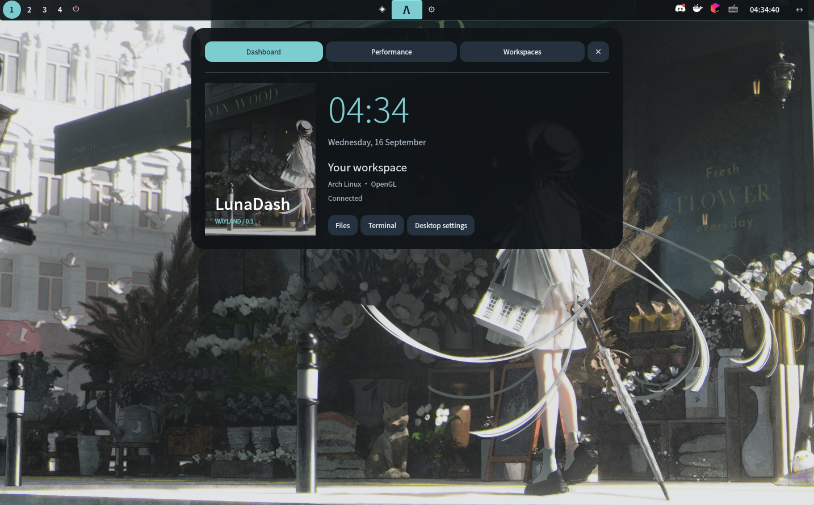
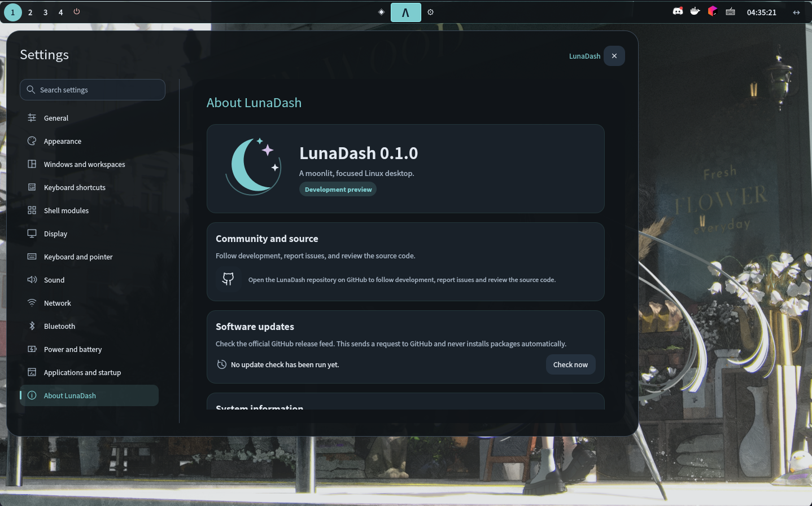
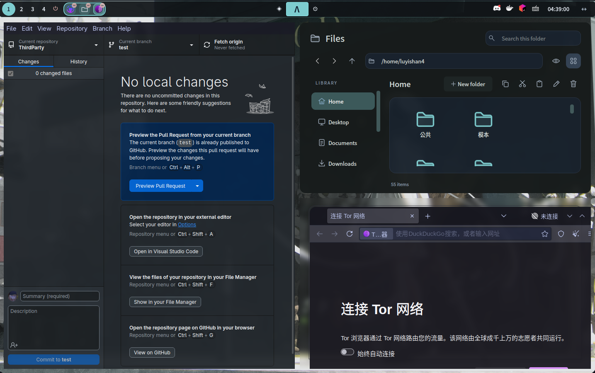
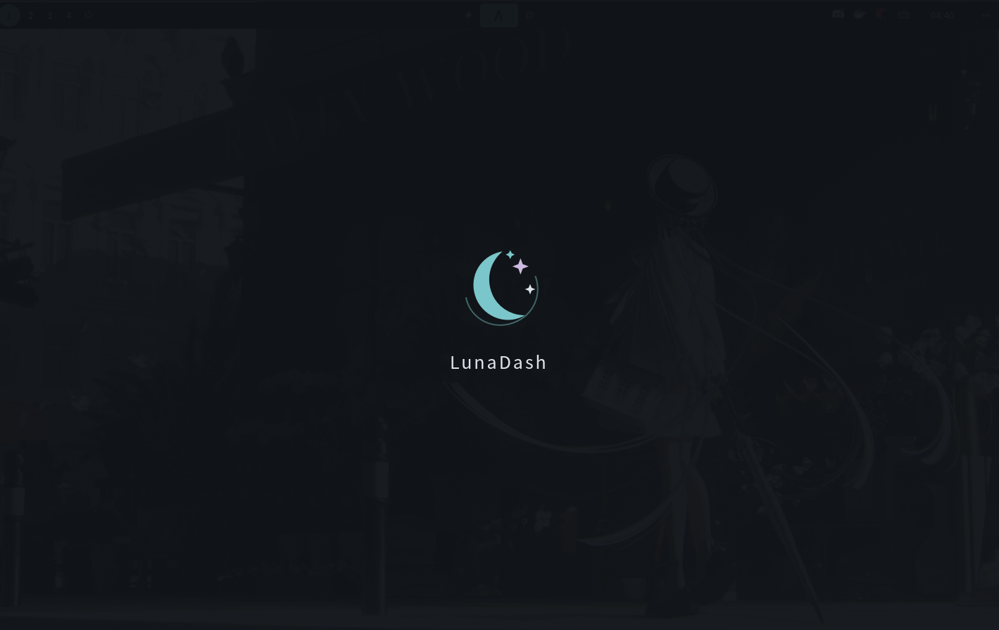

<div align="center">

<a href="https://luyishan-4.github.io/LunaDash/">
  
</a>

### A moonlit, focused Linux desktop

A Wayland desktop with scrollable window columns and a customizable Quickshell shell.<br>
Your workspaces, apps and everyday controls, together.

<p>
  <a href="#project-status"></a>
  <a href="https://github.com/LuYishan-4/LunaDash/actions/workflows/main-build.yml?query=branch%3Adev"></a>
  <a href="https://github.com/LuYishan-4/LunaDash/actions/workflows/main-wayland.yml?query=branch%3Adev"></a>
  <a href="LICENSE"></a>
</p>

**[Website](https://luyishan-4.github.io/LunaDash/)** · **[Get started](#get-started)** · **[Documentation](#documentation)** · **[Releases](https://github.com/LuYishan-4/LunaDash/releases)** · **[Issues](https://github.com/LuYishan-4/LunaDash/issues)**

</div>

## A look around

<p align="center">
  <a href="docs/image/1.png"></a><br>
  <sub>The dashboard keeps your workspace and everyday shortcuts close at hand.</sub>
</p>

<details>
<summary><strong>Explore the gallery — settings, windows and startup</strong></summary>
<br>
<table>
  <tr>
    <td width="50%" align="center"><a href="docs/image/2.png"></a><br><strong>One settings center</strong><br><sub>Appearance, input, devices and desktop preferences.</sub></td>
    <td width="50%" align="center"><a href="docs/image/5.png"></a><br><strong>Room for your apps</strong><br><sub>Grouped windows, familiar tools and built-in Files.</sub></td>
  </tr>
</table>
<p align="center">
  <a href="docs/image/6.png"></a><br>
  <sub>The LunaDash startup screen.</sub>
</p>

Screenshots show the evolving development preview; appearance may change between revisions.

</details>

## Made for your workflow

<table>
  <tr>
    <td width="50%" valign="top"><h3>↔ Scrollable workspaces</h3>Arrange windows in columns. Group, resize, float and move between workspaces with the keyboard.</td>
    <td width="50%" valign="top"><h3>☾ Your desktop, your style</h3>Choose colors, wallpaper, spacing and shell modules from a shared settings center.</td>
  </tr>
  <tr>
    <td valign="top"><h3>⌘ Everyday controls</h3>Open apps, adjust volume, check Wi-Fi and control compatible media players from the panel and dashboard.</td>
    <td valign="top"><h3>▤ Files and applications</h3>Manage files, choose default apps and use the file chooser portal. Launch X11 apps through on-demand XWayland.</td>
  </tr>
  <tr>
    <td valign="top"><h3>◉ Stay in the loop</h3>Desktop notifications, system status and removable-device controls live alongside your workspace.</td>
    <td valign="top"><h3>＋ Make it your own</h3>Customize QML modules and explore the plugin interfaces. Native plugins stay disabled by default.</td>
  </tr>
</table>

## Get started

**Try the development preview inside an existing Wayland desktop.** Install [Quickshell 0.3+](https://quickshell.org/docs/v0.3.0/guide/install-setup/) if your distribution does not provide it, then:

```sh
git clone --branch dev https://github.com/LuYishan-4/LunaDash.git
cd LunaDash
./scripts/install-dependencies.sh
cmake -S . -B build -G Ninja -DCMAKE_BUILD_TYPE=Release
cmake --build build --parallel 2
env -u MESA_GL_VERSION_OVERRIDE -u MESA_GLSL_VERSION_OVERRIDE \
  QT_QPA_PLATFORM=wayland ./build/lunadash-compositor --nested --socket ludash-test
```

The dependency helper detects your package manager. Add `--dry-run` to preview its commands. For toolchain requirements and automated checks, see the [build and testing guide](docs/TESTING_AND_FILES.md).

<details>
<summary><strong>Install a login session</strong></summary>

From the checkout, run:

```sh
./scripts/install-session.sh --dry-run
./scripts/install-session.sh
lunadash-session --check
```

Arch uses a local `makepkg` package; other supported distributions use a CMake installation under `/usr`. Keep your current desktop available while evaluating the preview. See the [login-session guide](docs/LOGIN_SESSION.md) for display-manager setup, installer options and recovery.

</details>

<details>
<summary><strong>A few shortcuts to get moving</strong></summary>

| Shortcut | Action |
| --- | --- |
| `Super` + `Return` / `E` / `D` | Terminal / Files / launcher |
| `Super` + `H` / `L` | Focus the left / right column |
| `Super` + `K` / `J` | Focus another window in the column |
| `Super` + `Space` | Toggle floating |
| `Super` + `1`–`9` | Switch workspace |
| `Super` + `Shift` + `1`–`9` | Move a window to a workspace |

Change bindings in **Settings → Keyboard shortcuts**. Your host desktop may intercept `Super` while running nested. See [settings and shortcuts](docs/SETTINGS.md) for grouping, resizing and control commands.

</details>

## Project status

LunaDash is an **active development preview**, with Arch Linux as the primary development platform.

| Platform | Coverage |
| --- | --- |
| Ubuntu 24.04 | Main build and runtime CI |
| Arch, Debian 13, Fedora 45, openSUSE Tumbleweed, Alpine Edge | Distribution source-build CI |
| Void, Gentoo | Installer paths; outside the current distribution CI matrix |
| Other Linux distributions | Manual dependencies and standard CMake installation |

See [Actions](https://github.com/LuYishan-4/LunaDash/actions?query=branch%3Adev) for results on each commit. CI covers builds, nested/headless sessions and software rendering; physical GPUs, multiple monitors and standalone login still need hardware testing. Screen locking and screen-sharing/PipeWire portals are incomplete. Native plugins execute in-process without a sandbox.

## Documentation

| Start here | Explore further |
| --- | --- |
| [Build and test](docs/TESTING_AND_FILES.md) | [Login session and recovery](docs/LOGIN_SESSION.md) |
| [Appearance and configuration](docs/CONFIGURATION.md) | [Settings and keyboard shortcuts](docs/SETTINGS.md) |
| [Files and default apps](docs/DEFAULT_APPS_AND_FILES.md) | [Input methods](docs/INPUT_METHODS.md) |
| [Shell modules](docs/MODULES.md) | [Plugins](docs/PLUGINS.md) |
| [Source architecture](docs/ARCHITECTURE.md) | [Graphics](docs/GRAPHICS.md) · [C core](docs/C_CORE.md) |

Built with **C++20 · C11 · wlroots · OpenGL · Qt 6 · Quickshell/QML**. Native code is organized into seven source domains, with embedded shaders and architecture checks in CI.

## Contribute

Bug reports, documentation improvements and patches are welcome. Open an [issue](https://github.com/LuYishan-4/LunaDash/issues) or send a pull request to **`dev`**, with relevant **docs and website updates**. Read [CONTRIBUTING.md](CONTRIBUTING.md) and the [release process](docs/RELEASE_PROCESS.md) before submitting.

---

<p align="center">
  <br>
  <strong>LunaDash</strong> · A moonlit, focused Linux desktop.<br>
  <a href="LICENSE">GPL-3.0-only</a>
</p>
