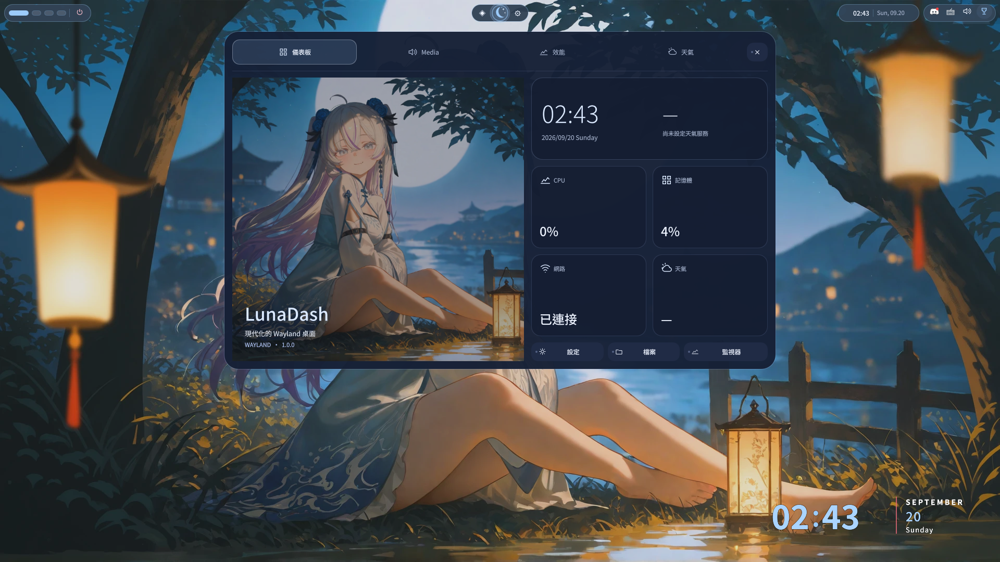
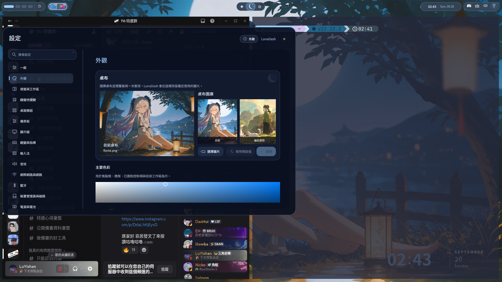
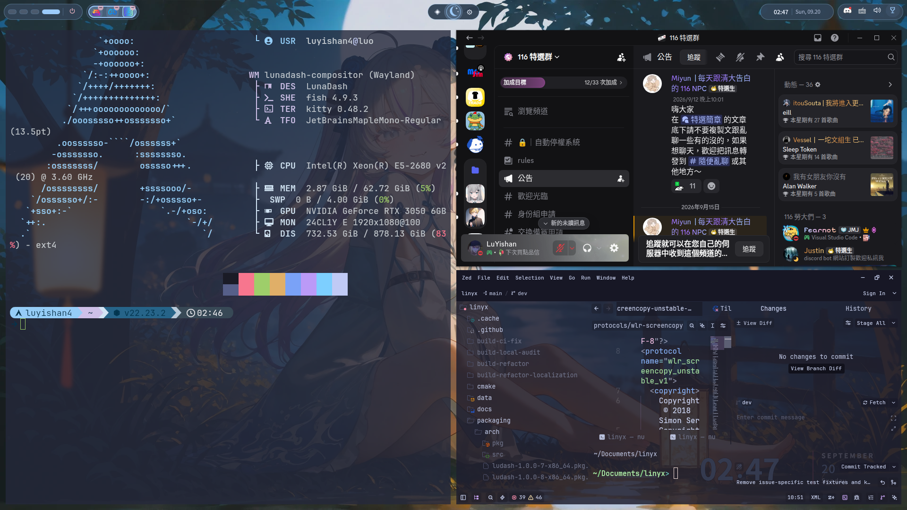
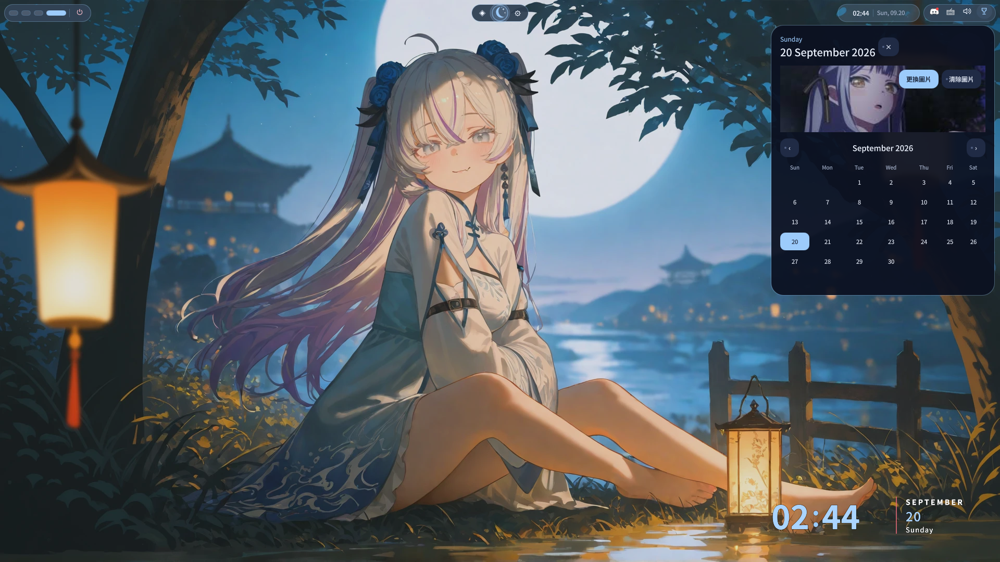

<div align="center">

<a href="https://luyishan-4.github.io/LunaDash/"></a>

### 一個桌面環境。

整合日常所需，也讓你依照習慣調整的 Wayland 桌面。<br>
**我們的目標：兼顧開箱即用與客製化，從第一次登入就開始好好使用。**

<p>
  <a href="#linux-distributions"></a>
  <a href="https://github.com/LuYishan-4/LunaDash/actions/workflows/main-build.yml?query=branch%3Adev"></a>
  <a href="https://github.com/LuYishan-4/LunaDash/pulls"></a>
  <a href="https://github.com/LuYishan-4/LunaDash/issues"></a>
  <a href="../../LICENSE"></a>
</p>

<a id="linux-distributions"></a>

[](https://archlinux.org)
[](https://fedoraproject.org)
[](https://ubuntu.com)

</div>

[English](../../README.md) · [繁體中文](README.zh-TW.md) · [简体中文](README.zh-CN.md) · [日本語](README.ja.md)

## LunaDash

- **日常功能一次備齊。** 面板、啟動器、儀表板、通知、設定與檔案工具都包含在桌面中。
- **配合你的工作方式。** 可捲動的平鋪視窗欄，每欄最多 8 個視窗；支援 Alt 拖曳、橫向視窗切換器和獨立工作列清單。
- **把預設變成自己的風格。** 在設定中調整桌布、色彩、間距、快捷鍵和預設應用程式。
- **需要時再深入。** 排列 shell 模組、修改 Quickshell/QML，或透過本機控制介面安排工作流程。

使用 **C++20 · C11 · wlroots · OpenGL · Qt 6 · Quickshell/QML** 開發。目前是持續開發中的預覽版本，以 Arch Linux 為主要開發平台。

<a id="gallery"></a>

## 畫面預覽

<table>
  <tr>
    <td width="50%" align="center"><a href="../image/LunaDash-20260920-024312-792.png"></a></td>
    <td width="50%" align="center"><a href="../image/LunaDash-20260920-024259-008.png"></a></td>
  </tr>
  <tr>
    <td width="50%" align="center"><a href="../image/LunaDash-20260920-024708-948.png"></a></td>
    <td width="50%" align="center"><a href="../image/LunaDash-20260920-024455-959.png"></a></td>
  </tr>
</table>

<sub>實際桌面截圖，拍攝於 2026 年 9 月 20 日。點選圖片查看原圖；配置與外觀皆可調整。</sub>

<a id="install"></a>

## 安裝

取得開發分支後，執行工作階段安裝程式：

```sh
git clone --branch dev https://github.com/LuYishan-4/LunaDash.git
cd LunaDash
./scripts/install-session.sh
```

安裝程式會處理發行版依賴、編譯 LunaDash 並安裝登入工作階段。完成後登出，在登入管理員中選擇 **LunaDash**。首次啟動會顯示歡迎訊息與網站求助連結。語言及桌面外觀可在設定中調整。

可先執行 `./scripts/install-session.sh --dry-run` 預覽安裝步驟。桌面 shell 需要 **Quickshell 0.3+**；若發行版未提供，安裝程式會指出缺少的依賴。選項與復原方式請見[安裝指南](../LOGIN_SESSION.md)，手動編譯與巢狀工作階段請見[建置與測試](../TESTING_AND_FILES.md)。

## 常用快捷鍵

| 快捷鍵 | 功能 |
| --- | --- |
| `Super` + `Return` / `E` / `D` | 終端機／檔案／啟動器 |
| `Super` + `T` | 開啟 Kitty（預設終端機） |
| `Super` + `H` / `L` | 聚焦左／右視窗欄 |
| `Super` + `K` / `J` | 聚焦欄內其他視窗 |
| `Alt` + `Tab` | 橫向選取視窗；放開 Alt 切換 |
| `Alt` + drag | 移動或交換位置；加 Shift 調整大小 |
| `Super` + `Shift` + `S` | 選取截圖範圍 |
| `Super` + `1`–`9` | 切換工作區 |

`Super` 即 Meta 鍵。可在 **設定 → 鍵盤快捷鍵** 中更改綁定。分組、調整大小與控制指令請見[設定文件](../SETTINGS.md)。

<a id="documentation"></a>

## 文件

| 開始使用 | 個人化 |
| --- | --- |
| [安裝與執行](../LOGIN_SESSION.md) | [外觀與組態](../CONFIGURATION.md) |
| [建置與測試](../TESTING_AND_FILES.md) | [設定與快捷鍵](../SETTINGS.md) |
| [顯示器、DDC/CI 與啟動](../DISPLAY_AND_STARTUP.md) | [Shell 模組](../MODULES.md) |
| [範圍截圖](../SCREEN_CAPTURE.md) | [預設應用程式與檔案](../DEFAULT_APPS_AND_FILES.md) |
| [原始碼架構](../ARCHITECTURE.md) | [外掛介面](../PLUGINS.md) |

<a id="contribute"></a>

## 參與貢獻

一起讓預設體驗更好用，也讓客製化更容易。歡迎回報問題、提出設計建議，以及貢獻文件與程式碼。

PR 請以 **`dev`** 為目標分支。主旨要清楚描述改動，說明使用者可見的結果、實際執行的檢查，以及影響的是預設行為還是選用的客製化功能。同步更新相關 **`docs/` 文件與網站內容**。

**PR 不得新增、修改、刪除或重新命名 `.github/workflows/` 下的檔案、`site/src/pages/releases/` 下的發布 Markdown（`.md`／`.mdx`），或 `site/src/data/releases.json`。** 發布影響寫在 PR 說明中，網站發布紀錄由 GitHub Release 自動產生。詳見[貢獻指南](../../CONTRIBUTING.md)與 [PR 範本](../../.github/pull_request_template.md)。

---

<p align="center"><br><strong>LunaDash</strong> · 目前該專案還不成熟歡迎回報或發PR。<br><a href="../../LICENSE">GPL-3.0-only</a></p>
